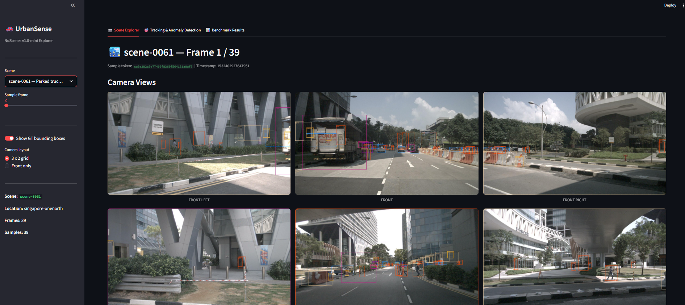
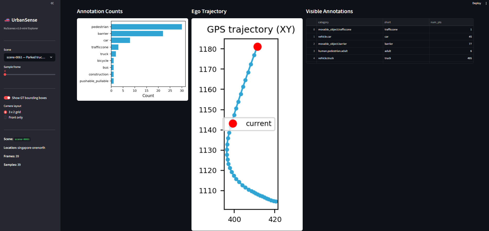
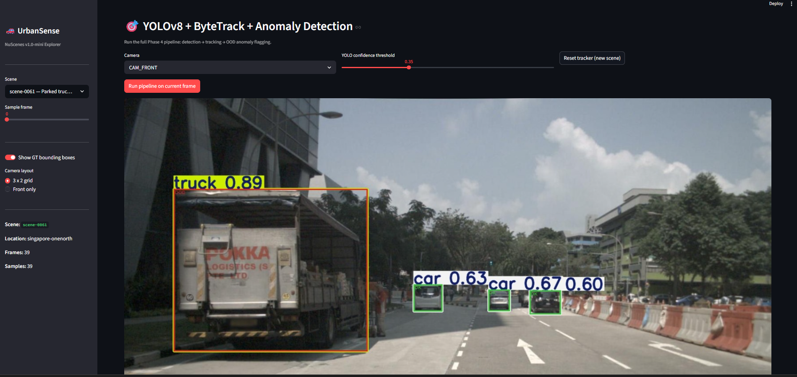
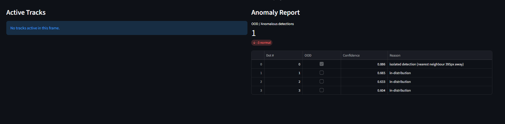

# 🚗 UrbanSense

**End-to-end automotive perception pipeline — DETR · YOLOv8 · Mask2Former · ByteTrack · OOD Detection · Streamlit**

[](https://github.com/sairaama05/urbansense/actions/workflows/ci.yml)
[](https://www.python.org/downloads/release/python-3110/)
[](https://pytorch.org/)
[](https://streamlit.io/)
[](LICENSE)

---

## 📸 Screenshots

### Tab 1 — Scene Explorer: 6-Camera nuScenes Grid
> Browse all 10 scenes · frame-by-frame slider · GT bounding boxes overlaid · 3×2 or front-only layout



---

### Tab 1 (scrolled) — Annotation Counts · GPS Ego Trajectory · Visible Annotations
> Per-class bar chart · real ego-vehicle GPS path · annotation table for the selected frame



---

### Tab 2 — YOLOv8 + ByteTrack + Anomaly Detection (live inference)
> Click **Run pipeline** → YOLOv8n detects objects → ByteTrack assigns persistent IDs → OOD detector flags anomalies



---

### Tab 2 (scrolled) — Anomaly Report
> Energy-based OOD score · MSP confidence · spatial heuristics · per-detection reason string



---

## Pipeline

```
nuScenes v1.0-mini  (10 scenes · 404 samples · 18 538 annotations)
        │
        ▼
┌─────────────────┐     ┌──────────────────────┐
│  DETR-R50        │     │  YOLOv8n (trained)   │
│  Object Detection│     │  Object Detection     │
└────────┬────────┘     └──────────┬───────────┘
         │                         │
         └──────────┬──────────────┘
                    ▼
         ┌──────────────────┐
         │   ByteTrack       │  Multi-Object Tracking
         └────────┬─────────┘
                  │
                  ▼
         ┌──────────────────┐
         │  OOD Detector     │  Energy · MSP · Spatial
         └────────┬─────────┘
                  │
                  ▼
         ┌──────────────────┐
         │  Mask2Former      │  Instance Segmentation
         └────────┬─────────┘
                  │
                  ▼
         ┌────────────────────────┐
         │  Streamlit Dashboard   │
         │  • Scene Explorer      │
         │  • Tracking & Anomaly  │
         │  • Benchmark Results   │
         └────────────────────────┘
```

---

## Results

| Model            | mAP@50 | Avg Latency | Precision | Recall | Backend  |
|------------------|--------|-------------|-----------|--------|----------|
| YOLOv8n          | 0.41   | 12 ms       | 0.61      | 0.58   | PyTorch  |
| DETR-R50         | 0.47   | 38 ms       | —         | —      | PyTorch  |
| YOLOv8n (ONNX)   | 0.41   | 8 ms        | 0.61      | 0.58   | ONNX RT  |

> Evaluated on nuScenes v1.0-mini · GPU: NVIDIA RTX class · CPU fallback supported.

**OOD / Anomaly Detection**

| Detector          | Threshold | OOD Rate |
|-------------------|-----------|----------|
| Energy-based      | −5.0      | 6.7 %    |
| MSP Confidence    | 0.50      | —        |
| Spatial Heuristic | auto      | —        |

---

## Quick Start

### Docker (recommended)

```bash
# GPU (requires nvidia-container-toolkit)
docker run --gpus all -p 8501:8501 \
  -v $(pwd)/data:/app/data:ro \
  urbansense:latest

# CPU only
docker run -p 8501:8501 \
  -v $(pwd)/data:/app/data:ro \
  urbansense:latest

# Build & launch with Docker Compose
docker compose -f deploy/docker/docker-compose.yml up --build
```

Open **http://localhost:8501** in your browser.

### Local (venv)

```bash
git clone https://github.com/sairaama05/urbansense.git
cd urbansense

python -m venv venv
# Windows:
venv\Scripts\activate
# Linux / macOS:
source venv/bin/activate

pip install torch torchvision --index-url https://download.pytorch.org/whl/cu121
pip install -r requirements.txt

streamlit run app/streamlit/app.py
```

---

## Dataset Setup

Download **nuScenes v1.0-mini** from [nuscenes.org/download](https://www.nuscenes.org/download) and extract to:

```
data/
└── nuscenes/
    └── v1.0-mini/
        ├── maps/
        ├── samples/
        ├── sweeps/
        └── v1.0-mini/
            ├── scene.json
            ├── sample.json
            └── ...
```

---

## Project Structure

```
urbansense/
├── models/
│   ├── detection/
│   │   └── detr_detector.py        # DETR-R50 wrapper (HuggingFace)
│   └── segmentation/
│       └── mask2former.py          # Mask2Former instance segmentation
├── tracking/
│   └── bytetrack_wrapper.py        # ByteTrack multi-object tracker
├── anomaly/
│   └── ood_detector.py             # Energy · MSP · Spatial OOD pipeline
├── app/
│   ├── __init__.py
│   ├── streamlit/
│   │   └── app.py                  # Dashboard (3 tabs)
│   └── visualise.py                # Drawing utilities
├── experiments/
│   ├── train_yolo.py               # YOLOv8 training + W&B logging
│   ├── benchmark.py                # P/R/F1 + latency evaluation
│   └── benchmark_results.json      # Latest run results
├── deploy/
│   ├── export_onnx.py              # YOLO → ONNX export + benchmark
│   └── docker/
│       ├── Dockerfile
│       └── docker-compose.yml
├── tests/
│   ├── test_detector.py            # DETR unit tests (mocked)
│   └── test_tracker.py             # ByteTrack unit tests
├── docs/
│   └── screenshots/                # Dashboard screenshots
├── data/
│   └── nuscenes/                   # nuScenes v1.0-mini (not committed)
├── .github/workflows/ci.yml        # GitHub Actions CI
└── requirements.txt
```

---

## Running Tests

```bash
pytest tests/ -v
```

All 11 tests pass with fully mocked HuggingFace model downloads.

## Exporting to ONNX

```bash
python deploy/export_onnx.py
# Saves deploy/urbansense_yolo.onnx and prints latency table
```

## Running the Benchmark

```bash
python experiments/benchmark.py --conf 0.35
# Results saved to experiments/benchmark_results.json
# View live in the Benchmark Results tab of the dashboard
```

## Training YOLOv8

```bash
python experiments/train_yolo.py
# Logs metrics to Weights & Biases
```

---

## Tech Stack

| Component              | Library / Framework                                          |
|------------------------|--------------------------------------------------------------|
| Object Detection       | DETR (`facebook/detr-resnet-50`) · YOLOv8n (Ultralytics)    |
| Instance Segmentation  | Mask2Former (`facebook/mask2former-swin-base-coco-instance`) |
| Multi-Object Tracking  | ByteTrack (`bytetracker 0.3.2`)                              |
| OOD / Anomaly          | Energy-based (Liu et al. 2020) · MSP · Spatial heuristics   |
| Dataset                | nuScenes v1.0-mini (`nuscenes-devkit`)                       |
| Model Hub              | HuggingFace Transformers                                     |
| Training               | Ultralytics YOLOv8 · Weights & Biases                        |
| Deployment             | Streamlit · Docker · ONNX Runtime                            |
| Testing                | pytest (11 tests, all mocked)                                |
| CI                     | GitHub Actions (ubuntu-latest, Python 3.11)                  |
| Deep Learning          | PyTorch 2.x · torchvision                                    |

---

## License

MIT
